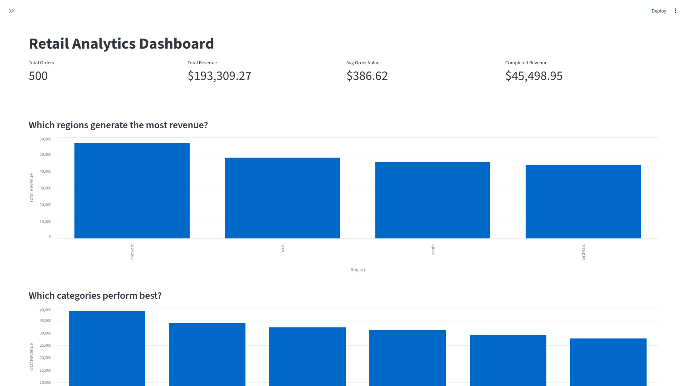

# Retail Analytics Pipeline

A portfolio data engineering project that simulates a retail analytics workflow from raw order generation to warehouse modeling, SQL analysis, and dashboard reporting.

## Overview

This project demonstrates an end-to-end batch analytics pipeline using Python, DuckDB, SQL, and Streamlit.

It starts with synthetic retail order events, transforms and validates them, loads them into a local DuckDB warehouse, models them into analytics tables, and exposes business insights through SQL queries and a dashboard UI.

## Architecture

The pipeline follows a simple layered design:

```text
Raw Data Generation
        ↓
Processed / Cleaned Data
        ↓
DuckDB Warehouse
        ├── fact_orders
        ├── dim_date
        └── dim_customers
        ↓
Analytics SQL Queries
        ↓
Streamlit Dashboard
```

## Tech Stack

- Python
- DuckDB
- SQL
- Pandas
- NumPy
- Streamlit
- Altair
- Pytest
- Makefile

## Project Goals

This project is meant to show:

- raw data ingestion and generation
- ETL transformation and validation
- warehouse-style modeling with fact and dimension tables
- SQL-based analytics queries
- dashboard reporting for business stakeholders
- a clean, interview-ready project structure

## Project Structure

```text
RetailAnalyticsPipeline/
├── data
│   ├── processed
│   │   ├── retail_kpis.csv
│   │   ├── retail_orders_clean.jsonl
│   │   └── retail_order_summary.json
│   ├── raw
│   │   └── retail_orders.jsonl
│   └── warehouse
│       └── retail.duckdb
├── sql
│   ├── analytics
│   │   ├── daily_revenue_trend.sql
│   │   ├── kpi_summary.sql
│   │   ├── orders_by_status.sql
│   │   ├── revenue_by_customer_segment.sql
│   │   ├── revenue_by_region.sql
│   │   ├── revenue_by_weekday.sql
│   │   └── top_categories.sql
│   └── models
├── src
│   ├── dashboard
│   │   └── app.py
│   ├── etl
│   │   ├── aggregate_retail_orders.py
│   │   ├── create_dim_customers_table.py
│   │   ├── create_dim_date_table.py
│   │   ├── create_fact_orders_table.py
│   │   ├── export_retail_kpis.py
│   │   ├── query_retail_kpis.py
│   │   ├── transform_retail_orders.py
│   │   └── validate_retail_orders.py
│   ├── ingestion
│   │   └── generate_retail_data.py
│   └── run_retail_pipeline.py
├── tests
│   ├── etl
│   │   └── test_transform_retail_orders.py
│   └── conftest.py
├── Makefile
├── README.md
└── requirements.txt
```

## Warehouse Model

The DuckDB warehouse contains a small star-schema-style layout:

### fact_orders
The central transaction table containing one row per retail order.

Example fields:
- order_id
- customer_id
- product_id
- order_date
- category
- region
- payment_method
- order_status
- quantity
- unit_price
- total_amount

### dim_date
A calendar dimension used for time-based analysis.

Example fields:
- date_key
- full_date
- year
- month
- month_name
- day
- weekday_name
- weekend_flag

### dim_customers
A customer lookup dimension used for segmentation analysis.

Example fields:
- customer_id
- customer_segment

## Analytics Questions Answered

The SQL analytics layer answers questions like:

- How many total orders were placed?
- What is total revenue and average order value?
- Which regions generate the most revenue?
- Which product categories perform best?
- How are orders distributed by status?
- How is revenue trending over time?
- How do customer segments perform?
- Which weekdays generate the most revenue?

## Setup

### 1. Clone the repository

```bash
git clone https://github.com/paulbylina/RetailAnalyticsPipeline.git
cd RetailAnalyticsPipeline
```

### 2. Create and activate a virtual environment

```bash
python -m venv .venv
source .venv/bin/activate
```

### 3. Install dependencies

```bash
pip install -r requirements.txt
```

Or with Make:

```bash
make install
```

## Running the Pipeline

### 1. Generate raw retail data

```bash
python src/ingestion/generate_retail_data.py
```

### 2. Transform and validate the data

```bash
python src/etl/transform_retail_orders.py
python src/etl/validate_retail_orders.py
python src/etl/aggregate_retail_orders.py
```

### 3. Build the DuckDB warehouse tables

```bash
python src/etl/create_fact_orders_table.py
python src/etl/create_dim_date_table.py
python src/etl/create_dim_customers_table.py
```

Or with Make:

```bash
make create-fact-orders-table
make create-dim-date-table
make create-dim-customers-table
```

## Running Analytics Queries

Example:

```bash
make kpi-summary-df
make revenue-by-region-df
make top-categories-df
make orders-by-status
make daily-revue-trend
make revenue-by-customer-segment
make revenue-by-weekday
```

## Running the Dashboard

Start the Streamlit dashboard:

```bash
streamlit run src/dashboard/app.py
```

Or with Make:

```bash
make streamlit
```

The dashboard includes:
- KPI summary cards
- revenue by region
- top categories
- daily revenue trend
- customer segment performance
- weekday revenue analysis

## Testing

Run tests with:

```bash
pytest
```

## Dashboard Preview




## Future Improvements

Potential next steps:
- GitHub Actions CI
- Docker support
- Airflow orchestration
- dbt-style SQL models
- more robust tests
- dashboard filters and richer interactivity
- cloud deployment

## Why This Project Matters

This project is designed to show practical data engineering skills in a portfolio-friendly format.

It demonstrates the ability to:
- structure a data project cleanly
- build ETL pipelines
- model analytics data in a warehouse pattern
- write business-facing SQL
- present results through a dashboard UI