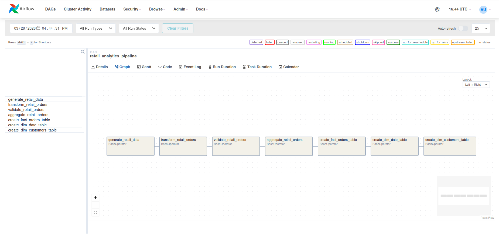

# *Retail Analytics Pipeline* 

## Overview
RetailAnalyticsPipeline is an end-to-end batch analytics project that simulates a modern retail data workflow. It generates raw retail data, transforms it with Python/SQL and PySpark, loads curated datasets into DuckDB, orchestrates jobs with Airflow, and serves business insights through a Streamlit dashboard. The project is designed to demonstrate practical data engineering skills including modeling, orchestration, testing, containerization, and analytics delivery.

## Current Scope
**Implemented**:
- Batch pipeline
- Local warehouse in DuckDB
- Airflow orchestration
- Docker / Docker Compose
- GitHub Actions CI
- Streamlit dashboard
- Optional BigQuery warehouse target for `fact_orders`
- BigQuery verification script
- Local streaming pipeline using Redpanda
- Python producer publishing retail order events to a Kafka-compatible topic
- Python consumer loading streamed events into DuckDB
- Streaming smoke test for `retail_order_events`
- PySpark transformation path for curated `fact_orders`
- Curated Spark Parquet output at `data/curated/fact_orders_spark.parquet`
- Spark smoke test for curated output

**Future enhancements**:
- Streaming ingestion
- dbt models
- Expanded data quality checks and observability
- Kubernetes deployment

## Tech Stack
- Python
- SQL
- Pyspark
- DuckDB
- Pandas
- NumPy
- Streamlit
- Altair
- Pytest
- Docker
- Docker Compose
- GitHub Actions
- Apache Airflow
- Makefile

## Architecture
The project follows a layered data engineering workflow:

```text
Raw Data Generation
        ↓
Processed / Cleaned Data
        ↓
DuckDB Warehouse
        ├── fact_orders
        ├── dim_date
        └── dim_customers
        ↓
Analytics SQL Queries
        ↓
Streamlit Dashboard

Automation / Orchestration
- GitHub Actions CI for automated test runs
- GitHub Actions pipeline workflow for scheduled/manual execution
- Airflow DAG for task orchestration
- Docker / Docker Compose for containerized local execution
```

## Project Structure
```text
RetailAnalyticsPipeline/
├── airflow
│   └── dags
│       └── retail_pipeline_dag.py
├── data
│   ├── processed
│   ├── raw
│   └── warehouse
├── docs
│   ├── airflow-dag.png
│   └── dashboard-screenshot.png
├── sql
│   └── analytics
│       ├── daily_revenue_trend.sql
│       ├── kpi_summary.sql
│       ├── orders_by_status.sql
│       ├── revenue_by_customer_segment.sql
│       ├── revenue_by_region.sql
│       ├── revenue_by_weekday.sql
│       └── top_categories.sql
├── src
│   ├── __init__.py
│   ├── dashboard
│   │   └── app.py
│   ├── etl
│   │   ├── __init__.py
│   │   ├── aggregate_retail_orders.py
│   │   ├── create_dim_customers_table.py
│   │   ├── create_dim_date_table.py
│   │   ├── create_fact_orders_table.py
│   │   ├── export_retail_kpis.py
│   │   ├── query_retail_kpis.py
│   │   ├── transform_retail_orders.py
│   │   └── validate_retail_orders.py
│   ├── ingestion
│   │   └── generate_retail_data.py
│   └── run_retail_pipeline.py
├── tests
│   ├── etl
│   │   └── test_transform_retail_orders.py
│   ├── conftest.py
│   └── test_warehouse_smoke.py
├── docker-compose.airflow.yml
├── docker-compose.yml
├── Dockerfile
├── Makefile
├── README.md
└── requirements.txt
```
* Generated pipeline outputs are written to the `data/raw`, `data/processed`, and `data/warehouse` directories when the pipeline runs.

## How to Run
### 1. Clone the repository
```bash
git clone https://github.com/paulbylina/RetailAnalyticsPipeline.git
cd RetailAnalyticsPipeline
```

### 2. Create and activate a virtual environment
```bash
python -m venv .venv
source .venv/bin/activate
```

### 3. Install dependencies
```bash
pip install -r requirements.txt
```

Or with Make:

```bash
make install
```

## Running the Pipeline
### 1. Generate raw retail data
```bash
python src/ingestion/generate_retail_data.py
```

### 2A. Transform and validate the data
```bash
python src/etl/transform_retail_orders.py
python src/etl/validate_retail_orders.py
python src/etl/aggregate_retail_orders.py
```
### 2B. Run the PySpark transform
```bash
make pyspark-transform
```

### 3. Build the DuckDB warehouse tables
```bash
python src/etl/create_fact_orders_table.py
python src/etl/create_dim_date_table.py
python src/etl/create_dim_customers_table.py
```

Or with Make:

```bash
make create-fact-orders-table
make create-dim-date-table
make create-dim-customers-table
```

## Running with Docker
### Recommended: Docker Compose
```bash
docker compose up
```

Or with Make:

```bash
make docker-run
```
## Manual Docker run
### Build the image

```bash
docker build -t retail-analytics-pipeline .
```
### Run the container:
```bash
docker run -p 8501:8501 retail-analytics-pipeline
```

## Running Analytics Queries
Example:

```bash
make kpi-summary-df
make revenue-by-region-df
make top-categories-df
make orders-by-status
make daily-revenue-trend
make revenue-by-customer-segment
make revenue-by-weekday
```

## Streamlit Dashboard
### Start with Bash

```bash
streamlit run src/dashboard/app.py
```

### Start with Make
```bash
make streamlit
```

The dashboard includes:
- KPI summary cards
- revenue by region
- top categories
- daily revenue trend
- customer segment performance
- weekday revenue analysis

## Airflow Orchestration
This project also includes an Airflow DAG for orchestrating the retail pipeline.



### Start Airflow:
```bash
docker compose -f docker-compose.airflow.yml up
```

or:
```bash
make airflow-up
```

UI will be available at:
[http://localhost:8080](http://localhost:8080)


### Login credentials:
```text
username: admin
password: admin123
```

### Shutdown
```bash
docker compose -f docker-compose.airflow.yml down
```

or:
```bash
make airflow-down
```

## DAG Included
- retail_analytics_pipeline
### This DAG orchestrates:
- raw retail data generation
- transformation
- validation
- aggregation
- fact table creation
- date dimension creation
- customer dimension creation

## BigQuery Cloud Target
This project includes an optional BigQuery warehouse target for the `fact_orders` table.

### Prerequisites
- Google Cloud project
- BigQuery API enabled
- Local Application Default Credentials configured with `gcloud auth application-default login`

### Environment Variables
```bash
export GCP_PROJECT_ID="retail-analytics-pipeline-01"
export BIGQUERY_DATASET="retail_analytics"
```

### Load fact_orders to BigQuery
```python
python src/load/load_fact_orders_to_bigquery.py
```
This reads the local DuckDB ```fact_orders```table and loads it into BigQuery.

### Verify the BigQuery table
```python
python src/load/verify_fact_orders_in_bigquery.py
```
This runs a smoke test against the BigQuery table and checks:
- row count
- distinct order_id count
- min/max order_date
- total revenue

### Current BigQuery Scope
Implemented:
- create dataset if it does not exist
- load fact_orders from DuckDB to BigQuery
- verify the loaded table with a cloud-side query

Planned:
- load dimension tables
- orchestrate cloud load with Airflow
- add BigQuery data quality assertions in CI

## CI / Automation
This project includes two GitHub Actions workflows:

- **CI workflow**: runs automated tests on pushes and pull requests
- **Retail pipeline workflow**: supports manual runs and scheduled pipeline execution

The pipeline workflow also uploads generated outputs as workflow artifacts so results can be inspected from GitHub Actions.

## Streaming Pipeline
This project includes a local streaming path built with Redpanda.

Flow:

Clean retail order events (JSONL)
→ Python producer
→ Redpanda topic (`retail-orders`)
→ Python consumer
→ DuckDB landing table (`retail_order_events`)

### Components
- **Broker:** Redpanda
- **Topic:** `retail-orders`
- **Producer:** `src/streaming/produce_retail_orders.py`
- **Consumer:** `src/streaming/consume_retail_orders_to_duckdb.py`
- **Landing table:** `retail_order_events` in DuckDB

### Start Redpanda
```bash
docker compose up -d redpanda redpanda-console
```

### Create the topic
```bash
docker exec -it redpanda rpk topic create retail-orders -p 1
```

### Produce events
```bash
python src/streaming/produce_retail_orders.py
```

### Consume events into DuckDB
```bash
python src/streaming/consume_retail_orders_to_duckdb.py
```

### Run the streaming smoke test
```bash
pytest tests/test_streaming_events_smoke.py -v
```
This streaming path demonstrates event-driven ingestion alongside the project’s existing batch pipeline.

### Test suites
- `pytest -m etl -v` → ETL/unit-style tests
- `pytest -m warehouse -v` → local DuckDB warehouse tests
- `pytest -m integration -v` → cloud integration tests (requires GCP credentials and environment variables)

Note: BigQuery integration tests are expected to skip in CI unless GCP credentials are configured.


## Spark Pipeline
This project includes a PySpark transformation path that builds a curated `fact_orders` dataset from cleaned retail order events.

#### Run the Spark transformation
```bash
python src/etl/run_spark_fact_orders.py
```
This reads data/processed/retail_orders_clean.jsonl and writes curated Parquet output to:
- data/curated/fact_orders_spark.parquet

#### Validate the Spark output
```bash
pytest tests/test_spark_fact_orders_smoke.py -v
```
This verifies:
- the Spark Parquet output exists
- the dataset has rows
- **order_id** remains unique
- **total_amount** is non-negative


## Planned Enhancements
- dbt-style SQL models
- more tests
  - validation tests
  - SQL smoke tests
  - dashboard smoke test
- dashboard filters and richer interactivity
- cloud deployment
- See [Databricks / GCP Architecture Mapping](docs/databricks-gcp-mapping.md) for how this project maps to a cloud-native Databricks + GCP stack.
- Streaming path planned with Redpanda: simulated retail order events -> Redpanda topic -> Python consumer -> DuckDB staging/events table.


## Dashboard Preview
